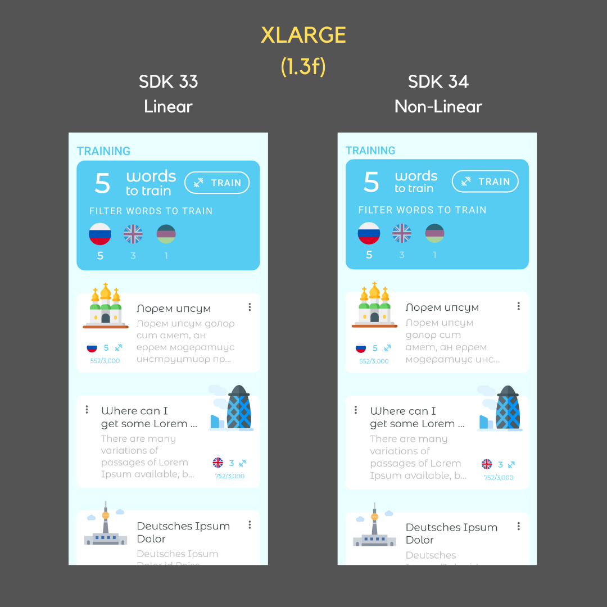
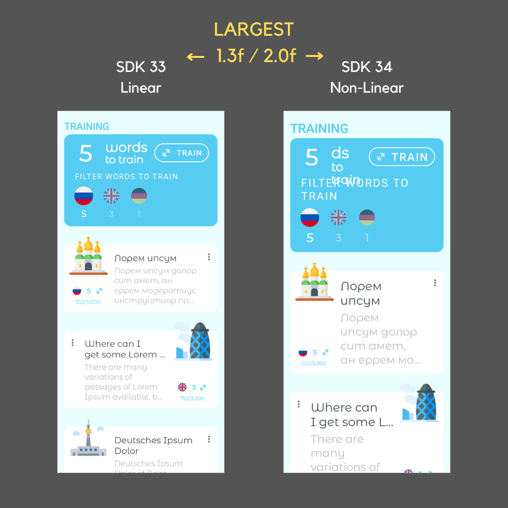

# Usage

In these sections, you'll find how to configure your screenshot tests with _AndroidUiTestingUtils_ with different libraries.\
\
Currently, the following configurations are supported:

* Locale
* UI Mode (i.e. Light/Dark mode)
* Custom theme
* Font Size
* Display Size

## Font Size

Since SDK 34, Android uses non-linear font scaling and enabled users to scale system fonts up to 200%.&#x20;

_AndroidUiTestingUtils_ allows setting font scaling via _FontSizeTestRule_ or _fontSize_ configuration in the corresponding _ActivityScenarioForXXXRule and RobolectricActivityScenarioForXXXRule,_ where XXX is an Activity, Fragment, View, Composable...\
\
You can set the font scaling factor value in several means:

### Custom Font Scale

```kotlin
FontSizeScale.Value(1.25f)
```

### Linear + Non-linear

You can also use the default values provided by _AndroidUiTestingUtils_, which correspond to those users can configure on their devices under _Configuration > Accessibility > Font Size._

```kotlin
FontSize.SMALL               // 0.85f
FontSize.NORMAL              // 1.00f
FontSize.LARGE               // 1.15f
FontSize.XLARGE              // 1.30f
FontSize.XXLARGE             // 1.50f
FontSize.XXXLARGE            // 1.80f
FontSize.LARGEST             // SDK 34+ -> 2.00f, SDK < 34 -> 1.3f

FontSize.MAXIMUM_LINEAR      // 1.30f
FontSize.MAXIMUM_NON_LINEAR  // 2.00f
```


Keep in mind that the same value might result in a different screenshot depending on whether the SDK the tests are running on supports linear or non-linear font scaling


<figure><figcaption><p>XLARGE FontSize on Pixel 5</p></figcaption></figure>

Some of these values are only available on devices running an SDK that supports non-linear scaling (i.e. SDK 34+)


You can get an Array with only the Linear/Non-Linear values depending on the SDK with\
`FontSizeScale.supportedValuesForCurrentSdk()`

You can find these values below


### Linear

```kotlin
FontSize.SMALL        // 0.85f
FontSize.NORMAL       // 1.00f
FontSize.LARGE        // 1.15f
FontSize.LARGEST      // 1.30f
```


Previous to _AndroidUiTestingUtils_ _2.3.0_, only these values were supported


### Non-linear

```kotlin
FontSize.SMALL      // 0.85f
FontSize.NORMAL     // 1.00f
FontSize.LARGE      // 1.15f
FontSize.XLARGE     // 1.30f
FontSize.XXLARGE    // 1.50f
FontSize.XXXLARGE   // 1.80f
FontSize.LARGEST    // 2.00f
```


`FontSize.LARGEST` applies different scale factors depending on the SDK.


<figure><figcaption><p>LARGEST Font Size on Pixel 5</p></figcaption></figure>

### Skip Tests

You can skip not "officially" supported _FontSizeScale_ by using `assumeSdkSupports` at the beginning of the test, for instance:

```kotlin
private val targetFontSizeScale = FontSize.XXXLARGE

@get:Rule
val screenshotRule = ActivityScenarioForComposableRule(
        config = ComposableConfigItem(
            fontSize = targetFontSizeScale,
        )
    )

@Test
fun snapComposableTest() {
    // skips tests on SDK 34+, since XXXLARGE scale goes beyond 1.3f
    assumeSdkSupports(targetFontSizeScale)
    // your test here...
}
```
